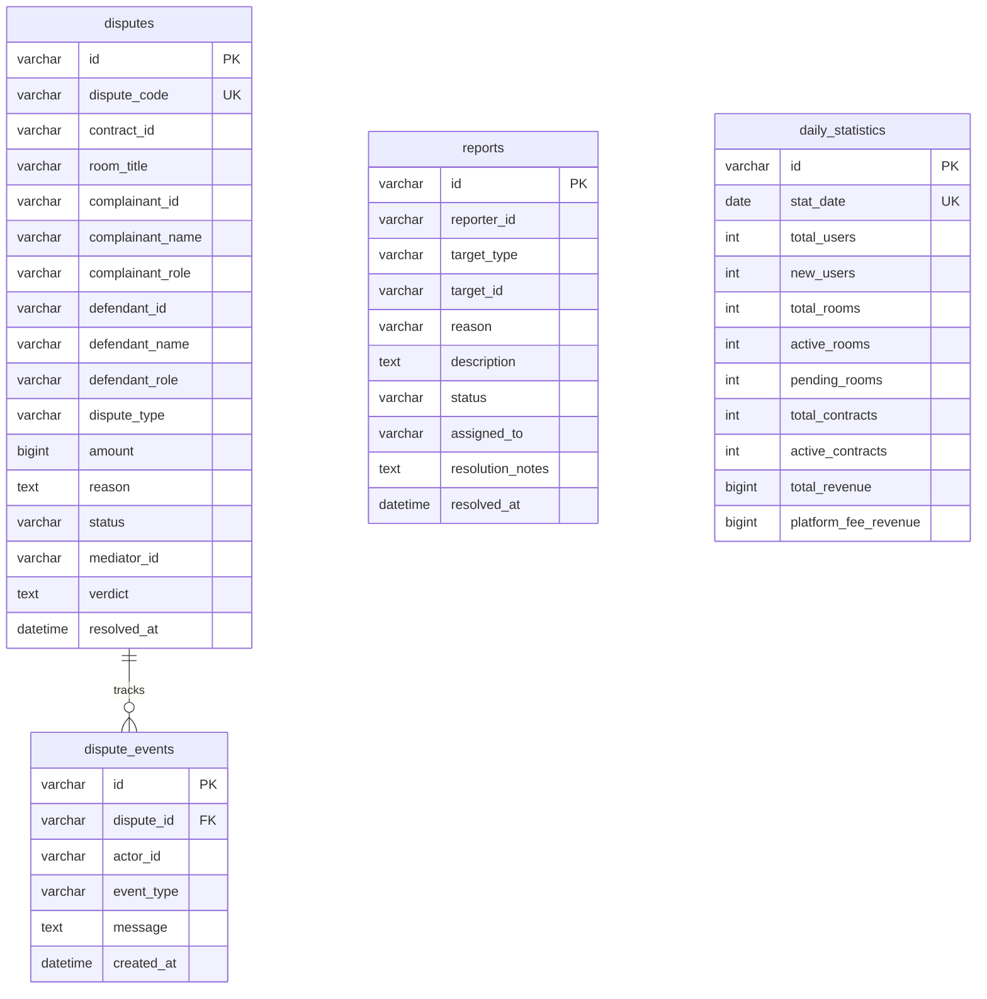

# Sơ Đồ Thực Thể - Admin Service (`toam_admin`)

```mermaid
erDiagram
    disputes ||--o{ dispute_events : "tracks"

    reports {
        varchar id PK
        varchar reporter_id
        varchar target_type
        varchar target_id
        varchar reason
        text description
        varchar status
        varchar assigned_to
        text resolution_notes
        datetime resolved_at
    }

    daily_statistics {
        varchar id PK
        date stat_date UK
        int total_users
        int new_users
        int total_rooms
        int active_rooms
        int pending_rooms
        int total_contracts
        int active_contracts
        bigint total_revenue
        bigint platform_fee_revenue
    }

    disputes {
        varchar id PK
        varchar dispute_code UK
        varchar contract_id
        varchar room_title
        varchar complainant_id
        varchar complainant_name
        varchar complainant_role
        varchar defendant_id
        varchar defendant_name
        varchar defendant_role
        varchar dispute_type
        bigint amount
        text reason
        varchar status
        varchar mediator_id
        text verdict
        datetime resolved_at
    }

    dispute_events {
        varchar id PK
        varchar dispute_id FK
        varchar actor_id
        varchar event_type
        text message
        datetime created_at
    }
```
