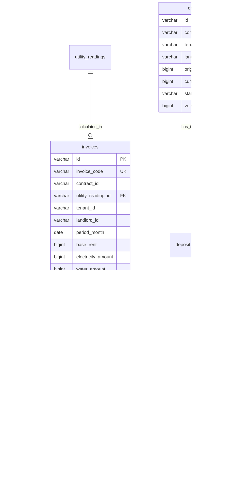

# Sơ Đồ Thực Thể - Billing Service (`toam_billing`)

```mermaid
erDiagram
    utility_readings ||--o| invoices : "calculated_in"
    invoices ||--o{ invoice_items : "contains"
    invoices ||--o{ payments : "paid_by"
    deposits ||--o{ deposit_transactions : "has_transactions"

    invoices {
        varchar id PK
        varchar invoice_code UK
        varchar contract_id
        varchar utility_reading_id FK
        varchar tenant_id
        varchar landlord_id
        date period_month
        bigint base_rent
        bigint electricity_amount
        bigint water_amount
        bigint service_amount
        bigint total_amount
        bigint paid_amount
        date due_date
        varchar status
        bigint version
    }

    invoice_items {
        varchar id PK
        varchar invoice_id FK
        varchar item_name
        varchar unit
        decimal quantity
        bigint unit_price
        bigint total_price
    }

    payments {
        varchar id PK
        varchar invoice_id FK
        varchar payer_id
        bigint amount
        varchar method
        varchar transaction_ref
        varchar status
        datetime paid_at
    }

    deposits {
        varchar id PK
        varchar contract_id UK
        varchar tenant_id
        varchar landlord_id
        bigint original_amount
        bigint current_balance
        varchar status
        bigint version
    }
```
