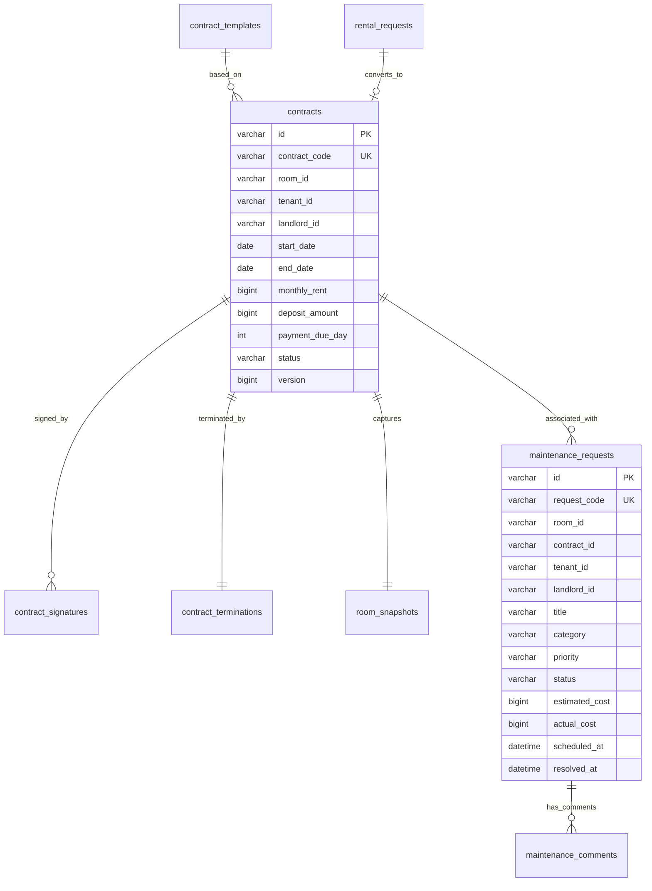

# Sơ Đồ Thực Thể - Booking Service (`toam_booking`)

```mermaid
erDiagram
    contract_templates ||--o{ contracts : "based_on"
    rental_requests ||--o| contracts : "converts_to"
    contracts ||--o{ contract_signatures : "signed_by"
    contracts ||--|| contract_terminations : "terminated_by"
    contracts ||--|| room_snapshots : "captures"
    contracts ||--o{ maintenance_requests : "associated_with"
    maintenance_requests ||--o{ maintenance_comments : "has_comments"

    contracts {
        varchar id PK
        varchar contract_code UK
        varchar room_id
        varchar tenant_id
        varchar landlord_id
        date start_date
        date end_date
        bigint monthly_rent
        bigint deposit_amount
        int payment_due_day
        varchar status
        bigint version
    }

    maintenance_requests {
        varchar id PK
        varchar request_code UK
        varchar room_id
        varchar contract_id
        varchar tenant_id
        varchar landlord_id
        varchar title
        varchar category
        varchar priority
        varchar status
        bigint estimated_cost
        bigint actual_cost
        datetime scheduled_at
        datetime resolved_at
    }
```
