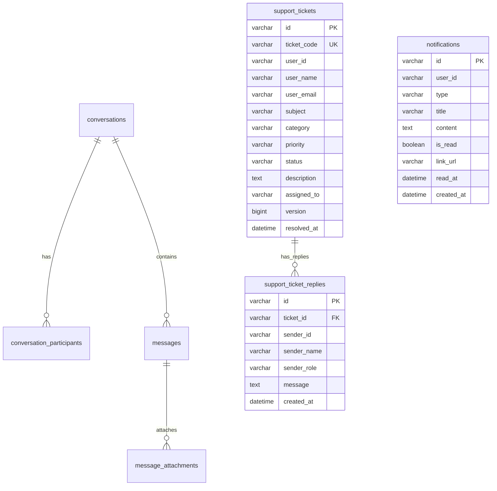

# Sơ Đồ Thực Thể - Communication Service (`toam_communication`)

```mermaid
erDiagram
    conversations ||--o{ conversation_participants : "has"
    conversations ||--o{ messages : "contains"
    messages ||--o{ message_attachments : "attaches"
    support_tickets ||--o{ support_ticket_replies : "has_replies"

    notifications {
        varchar id PK
        varchar user_id
        varchar type
        varchar title
        text content
        boolean is_read
        varchar link_url
        datetime read_at
        datetime created_at
    }

    support_tickets {
        varchar id PK
        varchar ticket_code UK
        varchar user_id
        varchar user_name
        varchar user_email
        varchar subject
        varchar category
        varchar priority
        varchar status
        text description
        varchar assigned_to
        bigint version
        datetime resolved_at
    }

    support_ticket_replies {
        varchar id PK
        varchar ticket_id FK
        varchar sender_id
        varchar sender_name
        varchar sender_role
        text message
        datetime created_at
    }
```
