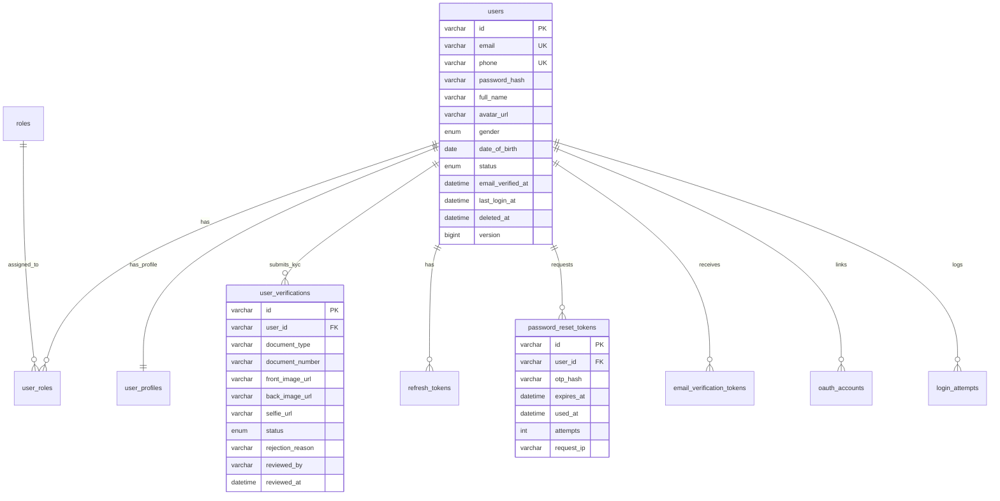

# Sơ Đồ Thực Thể - Identity Service (`toam_identity`)

```mermaid
erDiagram
    users ||--o{ user_roles : "has"
    roles ||--o{ user_roles : "assigned_to"
    users ||--|| user_profiles : "has_profile"
    users ||--o{ user_verifications : "submits_kyc"
    users ||--o{ refresh_tokens : "has"
    users ||--o{ password_reset_tokens : "requests"
    users ||--o{ email_verification_tokens : "receives"
    users ||--o{ oauth_accounts : "links"
    users ||--o{ login_attempts : "logs"

    users {
        varchar id PK
        varchar email UK
        varchar phone UK
        varchar password_hash
        varchar full_name
        varchar avatar_url
        enum gender
        date date_of_birth
        enum status
        datetime email_verified_at
        datetime last_login_at
        datetime deleted_at
        bigint version
    }

    user_verifications {
        varchar id PK
        varchar user_id FK
        varchar document_type
        varchar document_number
        varchar front_image_url
        varchar back_image_url
        varchar selfie_url
        enum status
        varchar rejection_reason
        varchar reviewed_by
        datetime reviewed_at
    }

    password_reset_tokens {
        varchar id PK
        varchar user_id FK
        varchar otp_hash
        datetime expires_at
        datetime used_at
        int attempts
        varchar request_ip
    }
```
