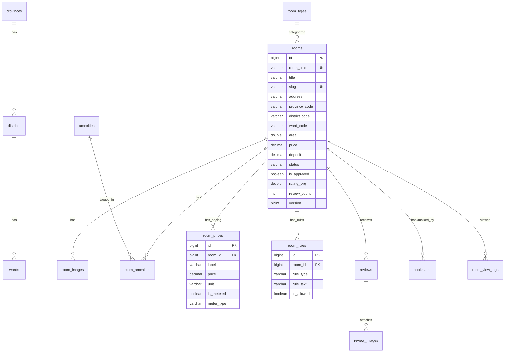

# Sơ Đồ Thực Thể - Listing Service (`toam_listing`)

```mermaid
erDiagram
    provinces ||--o{ districts : "has"
    districts ||--o{ wards : "has"
    room_types ||--o{ rooms : "categorizes"
    rooms ||--o{ room_images : "has"
    rooms ||--o{ room_amenities : "has"
    amenities ||--o{ room_amenities : "tagged_in"
    rooms ||--o{ room_prices : "has_pricing"
    rooms ||--o{ room_rules : "has_rules"
    rooms ||--o{ reviews : "receives"
    reviews ||--o{ review_images : "attaches"
    rooms ||--o{ bookmarks : "bookmarked_by"
    rooms ||--o{ room_view_logs : "viewed"

    rooms {
        bigint id PK
        varchar room_uuid UK
        varchar title
        varchar slug UK
        varchar address
        varchar province_code
        varchar district_code
        varchar ward_code
        double area
        decimal price
        decimal deposit
        varchar status
        boolean is_approved
        double rating_avg
        int review_count
        bigint version
    }

    room_prices {
        bigint id PK
        bigint room_id FK
        varchar label
        decimal price
        varchar unit
        boolean is_metered
        varchar meter_type
    }

    room_rules {
        bigint id PK
        bigint room_id FK
        varchar rule_type
        varchar rule_text
        boolean is_allowed
    }
```
